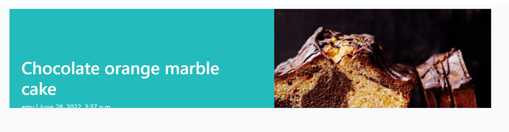

<!-- TOC -->
# Sweet Treats

Sweet Treats is a website that aims to create an online baking recipe community. This site allows users to share their favourite bakes with others as well as explore the site for new and exciting recipes that they can try at home.

Users can login, post their recipes, comment on posts by other users, edit posts they have previously uploaded, and like posts that have been uploaded by others. 

A link to the deployed website can be found <a href="https://sweet-treat-recipes.herokuapp.com/" alt="link to deployed heroku website">here</a>.

<!-- TOC -->
## Table of Contents
<!-- TOC start -->
- [Sweet Treats](#sweet-treats)
  * [Table of Contents](#table-of-contents)
    + [Project Design](#project-design)
    + [User Experience](#user-experience)
    + [Project Goals](#project-goals)
    + [User Stories](#user-stories)
    + [Wireframe](#wireframe-1)
    + [Game Features](#game-features)
    + [Future Features](#future-features)
    + [Languages Used](#languages-used)
    + [Technology Used](#technology-used)
    + [Testing](#testing)
      - [Validation Testing:](#validation-testing)
    + [Bugs:](#bugs)
      - [Fixed Bugs:](#fixed-bugs)
      - [Unfixed Bug:](#unfixed-bug)
    + [Deployment:](#deployment)
    + [References:](#references)
    + [Acknowledgements](#acknowledgements)
<!-- TOC end -->
 

<!-- TOC -->
### Project Design

- <a href="https://balsamiq.com/wireframes/">Balsamiq wireframes</a> was used to design the wireframes used in the design phase of this project. 

| Page | Wireframe |
| --- | --- |
| Home Page |  | 
| About Page |  | 
| Sign Up Page |  | 
| Sign In Page |  | 
| Delete Alert |  | 
| Medium Screen View |  | 
| Medium Screen View |  | 

- <a href="https://www.lucidchart.com/" >Lucid Charts</a> was used to design the unique models used in this project.

 

#### Colour Scheme
- Colours were chosen using <a href="https://www.color-hex.com/color-palette/50108" >Color Hex</a> was used to find matching colours to ensure a visually appealing colour scheme. 

 

<!-- TOC -->
### User Experience
<!-- TOC -->
### Project Goals
My personal goals for this project are that:
- The site is easy to navigate and user friendly.
- The purpose of the site is evident and inviting to users.
- That users want to create an account and engage with its content. 
 

<!-- TOC -->
### User Stories
As a user I want to:

- Easily understand the main purpose of the site, so that I can easily use the site.
- Easily navigate around the site, so that I can easily find content and clearly see where I am on the site.
- Be provided with a page containing a summary of all available posts so that I can decide what posts I would like to interact with. 
- Be able to read posts uploaded by other users in full and see any comments related those posts, so I can decide if I want to interact or try the recipe.
- See the author of posts and comments, so I can interact with them on the site.
- Sign up to the website, so that I can post my recipes, and then have the option to update and delete at a later date.
- Sign into the website, so that I can comment and like posts created by others.
- Easily log in and log out of my account. 
- Find links to contact the owner of the site on social media. 
- See the date a post or comment was created so that I can see any updates or suggestions to recipes.
- See how many comments are attached to a post before clicking in to view it so that I can decide to if my comment has been made already.
- See how many likes are on a post without having to enter it in detail.
- Be able to like and unlike recipes on the site. 
- Post my own recipes to the site so that I can share with others and receive feedback or suggestions on my recipe.
- Update and delete my own posts so that I can keep the information up to date or make any adjustments once I have tried a bake. 
- Comment on my own posts so that I can reply and interact with other users.
- Comment on posts uploaded by others so that I can engage with the baking community. 
- Access the site on various devices such as desktop, tablet or mobile to that I can use the site on the go. 
- Understand that if an error occurs how I can address it.
- Be notified when my interactions with the site have been successful for example when I have logged in/out successfully or when I have posted or commented on the site. 
- View a paginated list of posts so I can easily navigate through a list of posts. 

As an Admin I want to: 
- I can log in to allow management of a supportive and safe baking online community, by approving or removing posts and comments if required.
- I can log in and update or delete objectionable posts and comments if required.
- Create drafts so that I can return and finish writing content at a later date. 
- Like and unlike posts so that I can also interact with the site's contents. 

 

<!-- TOC -->
### Agile Design
- An Agile Approach was used to develop this site. This was achieved by breaking the project down into smaller tasks. 

To complete the overall aim of the Sweet Treats website concept, 14 issues were documented as specific tasks called User Stories. These User Stories are small sections of the project designed to accomplish a specific goal. 
The acceptance criteria I followed when completing this development project was that if when completing and testing each User Story, the task was completed successfully such as liking a post or logging in and out of the site then I deemed the passing conditions met. Once the User Story was working effectively it was moved across the Kanban board. 

As mentioned above this project used a Kanban board, which was set up in my <a href="https://github.com/AmyDelaney94/sweet-treats/projects/1" alt="link to Kanban Board">GitHub Projects here</a>, to help keep track of the work that was left to do, that was in progress and that was completed.

Examples of how my project progressed through the use of the Kanban board can be seen below.
| Week | Board |
| --- | --- |
| Week 1 |  | 
| Week 2 |    | 
| Week 3 |    |
| Week 4 |  | 
| Week 5 |  | 
| Week 6 |  | 
| Week 7 |  | 

 

<!-- TOC -->
### Current Features
The user stories mentioned above were used to ensure a positive UX was achieved.

| Feature | Details | Example |
| --- | --- | --- | 
| Favicon | - The favicon image was selected to continue with the baking theme of the site.   - The favicon icon is visible in the browser tab and search engine history.  - It adds a unique identifier to the site. |  | 
| Header | - The header is fixed at the top of the page which allows the user to scroll the site.   - The colour of #23bbbb was chosen as the main colour throughout the site and is used in the Header with white text which is easily read. |  |
| Footer | - The footer also carries the same colour scheme as the header.   - The footer contains social media links with added icons from Font Awesome   - Footer contains a created by and author's name. |  |
| Site Navigation | - The navigation bar changes depending on user status, with one view if logged in and a second view if logged out.   - The nav bar is responsive on smaller screen sizes it changes to a button with a dropdown list. |  |
| Pagination | - To improve UX pagination was added so that each page displays a maximum of 6 posts. |  | 
| Home Page | - The Recipes page is the sites landing page.   - It displays 6 posts per page and includes the author along with the number of likes on each post.   - Bootstrap was used to ensure all cards are the same height regardless of recipe title length.   - Date of publishing is also displayed on each recipe card.   - The colour theme is continued with the authors name featured on a #23bbbb background. |   |
| About Us  | - Font Awesome was used to add icons to page title.   -Aim and purpose of the page is displayed here.   - Tips for page navigation and log in benefits are also displayed here.   Link to the homepage and signup page are also embedded in the text. | |
| Post View  | - When a post is selected users can see the author, when it was posted, number of likes and comments and the featured image.  - Logged in users will be able to view the comment box.   - If users are logged in but not the author, they do not see the edit and delete options.   - If visitors to the site are not logged in, they cannot see the option to leave a comment. |    |
| Creating a Comment | - Text box is only displayed if user is logged in.   - Once published the time, date and authors name is published with the comment. |  |
| Creating a Post | - Logged in user has the ability to create a post.   - All fields must be filled in or a prompt appears before it allows user to submit the post.   Summernote Widgets were used for the Ingredients and Instruction sections to allow users to create easy to read posts.   - An option to add an image is also provided. |   | 
| Update and Delete Options | - If the author of a post is logged in they have the option to either edit or delete their post.   - The edit and delete buttons are the same colour theme as the rest of the site and redirect the user to the selected page. ||
| Updating a Post | Logged in author of a post has the ability to Update their post.   - All fields appear pre-populated with original information.   Summernote Widgets are also used for this feature.   - An option to add or change the image is also provided. |  |
| Deleting a Post | - If the author of a post selects to delete their post they will be asked to confirm again before deletion. | |
| Account Registration | - New users are asked to complete a registration form before continuing to the site. |  |
| Log in/out | Users that are returning have a simplified form to fill in that requires a username and password.   - A prompt appears when logout is selected asking the user to confirm their choice before continuing. |  |
| Admin Account | - A superuser was created for this project to manage the administration section.   - Admin users have more functionality than regular users and have full CRUD functionality over information such as users, posts and comments.   - Only approved admin users can access this section of the site. It is accessed by adding /admin to the URL home page and signing in. |  | 

 

<!-- TOC -->
### Future Features
Given more time to work on this project the overall scope of the website could be expanded. 
- User Profiles:
    - Allow users to create and edit their own user profiles.
    - As part of this they could add profile pictures and a brief biography about themselves. 
    - The User profile would also contain a list of recipes created by the user like an online recipe book.
- Paginate the comments section of the site to ensure that the page remains user friendly across all device sizes. 
- Add option to reply to comments to further enhance interactivity. 
- Allow users to view other profiles to connect with other bakers.
- Add a cancel button to the create and update recipe pages to prevent user from having to use home or back button.  

 

<!-- TOC -->
### Languages Used
- Python: Language chosen to develop the interaction with the server. 
- HTML: Markup language used to create the front end web pages.
- CSS: Styling language used to add custom styling to site.
 

<!-- TOC -->
### Technology Used
| Type | Technology | Function |
| --- | --- | --- | 
|Framework | Django| python framework used to create backend logic |
|Framework | Bootstrap5 | CSS Framework for developing mobile-first responsiveness across multiple screen sizes |
| Library | Django-allauth | Authentication library used to create the user accounts| 
| Library | Summernote | | WYSIWYG editor that allowed users to edit and personalise posts | 
| Application | Crispy Forms |  Used to manage Django Forms without having to re-write templates |
| Application | Psycopg2 | Database driver used to connect to the database to Python code | 
| Database | SQLite|  used as the database during development|
| Database | PostgreSQL| The database used to store all the data on deployment site | 
| Other Resources | Chrome DevTools | Used to debug and view changes | 
| Other Resources | Balsamiq Wireframes| Chosen to design wireframes during project planning | 
| Other Resources | LucidCharts |  Used to create models used in the project | 
| Other Resources | Cloudinary | Image hosting platform used to upload images |
| Other Resources | Font Awesome | Used for visual icons on the site to enhance UX | 
| Other Resources | Color-Hex and Color-Hexa | Used to choose colour scheme and ensure colours were complimentary | 
| Other Resources | Am I Responsive? | Used to see responsive design throughout the process.
| GitHub | GitHub Projects | Used to visually track the progress of the project | 
| GitHub | GitHub Issues | Used to create the user stories managed in GitHub Projects | 
| Host | GitHub | To store the source code and ReadMe for the project | 
| Host | GitPod | IDE selected to build the project | 
| Host | Heroku | To Host the deployed website | 
| Package Manager | Pip3 | Used to install extra software not found in Python Library
 

<!-- TOC -->
### Testing
| Feature Tested| Testing Method | Example | Result |  
| --- | --- | --- | --- | 
| Registration - Blank Field |- Each mandatory field was left blank intentionally to ensure error messages appeared |  | Pass | 
| Registration - Invalid Email Field | - An invalid email address was tested to ensure error message appeared| | Pass | 
| Registration - Common Password |- A common password was tested to check security | | Pass | 
| Registration - Short Password |- A short password was tested to check that an error appears if less than 8 characters entered | | Pass | 
| Sign in - Blank Field | - Each mandatory field was left blank intentionally to ensure alert appeared || Pass | 
| Sign in - Incorrect Username Field | - Tested with incorrect spelling, non-capitalised letter|| Pass |
| Sign in - Incorrect Password Field | - Tested with incorrect spelling and capitalisation of some letters to ensure account security || Pass |
| Non-Signed in user - like  | - Like button is not activated |  | Pass |  
| Non-Signed in user - comment  | - Page does not show post comment option | | Pass |
| Non-Signed in user - create  | - nav bar does not show create option | | Pass | 
| Signed in user - like  | - Like button is activated |  | Pass | 
| Signed in user - comment  | - Page shows post comment option| | Pass |
| Signed in user - create  | - nav bar shows create post option |  | Pass | 
| Create a post - no image |- This was tested with no image being uploaded by the user creating the post to ensure that the placeholder image successfully posted. |  | Pass |
| Create a post - Blank Fields |- This was tested with multiple times with one field being left blank each time. Pass criteria is that alert appears to prevent successful posting until all fields have been completed |  | Pass |
| Update a post - not author | - If user is not the author of the post edit and delete options should not be available to them | | Pass |
| Delete a post - not author |- If user is not the author of the post edit and delete options should not be available to them | | Pass |
| Update a post - author - Blank Field | - This was tested with multiple times with one field being left blank each time. Pass criteria is that alert appears to prevent successful posting until all fields have been completed |  | Pass |
| Update a post - author - Pre-populated Data | - When update is selected all data from the original post should be pre-populated | | Pass |
| Update a post - author - Change Image | - When updating a post the user has the option to change the image that they have selected. The page displays the current image name and if any new image has been uploaded | | Pass
| Update and Delete options - author | - If user is author of post edit and delete options should be available to them |  | Pass | 
| Delete a post - author | - Testing if alert appears to confirm before deletion. |  | Pass |
| Site Alert - sign in | Alert to confirm successful signing in. |  | Pass |
| Site Alert - sign out |- Alert requests user to confirm before logging out of site. |  | Pass |
| Site Alert - sign out |- Alert to confirm successful signing out. |  | Pass |
| Site Alert - create post |- Alert to confirm successful post creation. |  | Pass |
| Site Alert - publish comment | - Page shows comment posted complete. |  | Pass |
| About Page - Links | - Testing if signup and home page link are activated. Both of these links are active and take the user to the correct location on the site when selected. | | Pass | 
| Admin CRUD functionality | - The admin account has access to create, update and delete posts |  | Pass |
| Admin - restricted access | - Only the admin account can log into the admin view panel. |  | Pass |

<!-- TOC -->
#### Validation Testing:
| Resource Used | Code Tested | Example | Result |  
| --- | --- | --- | --- | 
| <a href="https://jigsaw.w3.org/css-validator/validator">W3C CSS Validator </a> | style.css |  | Pass  |
| <a href="https://validator.w3.org/nu/#textarea">Html Checker</a> | base.html |  | Pass - Warnings can be ignored as this is the structure of the base.html file. |
| <a href="https://validator.w3.org/nu/#textarea">Html Checker</a> | index.html |  | Pass | 
| <a href="https://validator.w3.org/nu/#textarea">Html Checker</a> | about.html | | Pass  |
| <a href="https://validator.w3.org/nu/#textarea">Html Checker</a> | posts.html |  | Pass | 
| <a href="https://validator.w3.org/nu/#textarea">Html Checker</a> | create_post.html |  | Pass | 
| <a href="https://validator.w3.org/nu/#textarea">Html Checker</a> | delete_post.html | | Pass  | 
| <a href="https://validator.w3.org/nu/#textarea">Html Checker</a> | update_post.html |  | Pass | 
| <a href="http://pep8online.com/ ">Pep8 Validator </a> | sweet_treats/urls.py |  | Pass |
| <a href="http://pep8online.com/ ">Pep8 Validator </a> | urls.py |  | Pass |
| <a href="http://pep8online.com/ ">Pep8 Validator </a> | models.py |  | Pass |
| <a href="http://pep8online.com/ ">Pep8 Validator </a> | urls.py |  | Pass |
| <a href="http://pep8online.com/ ">Pep8 Validator </a> | forms.py |  | Pass |
| <a href="http://pep8online.com/ ">Pep8 Validator </a> | apps.py |  | Pass |

 

#### Lighthouse Testing
- The site was also tested for its <a href="https://web.dev/performance-scoring/"> Lighthouse Performance Score </a>and the results were as follows.
  - On a desktop screen the home page and about page scored 92 and 99 respectively, the create page result was significantly lower, however this was attributed to Chrome extensions impacting the load time. 
  - All three pages scored highly in the accessibility, best practices and SEO sections of the performance analysis. 

 

<!-- TOC -->
### Bugs:

<!-- TOC -->
#### Fixed Bugs:
| Bug | Appearance | Solution |
| --- | --- | --- | 
| Cropped Text |  | - On laptops and larger screens the author and posted date was cropped in the masthead section of the Recipe page on posts with longer titles.   - This was corrected by increasing the height of the area from 40vh to 45vh. |
| Double Like |  | - On mobile and tablet devices the like symbol appeared twice in error.   - This was solved by moving the span to within the if statement. 

<!-- TOC -->
#### Unfixed Bug:
- When creating a recipe, the user has the option to select the author even though the page states 'posting as X'. I tried removing the select author field however it resulted in an error. This field allows the user to select any name from registered users, but they are then prevented from editing or deleting the post they have created as their name does not match the author name. As a result I have updated the about.html page to instruct users to select their own name from the dropdown menu.
Given more time I would investiagte this bug further and adjust the forms and models to remove the requirement for the author field to be present. 

 

<!-- TOC -->
### Deployment:
Heroku was used to deploy the site and it was achieved by following the steps below:
  1.	Go to the Heroku's website.
  2.	Create an account if required or select log in.
  3.	From the Heroku dashboard, click on the “New” button in top righthand corner then "Create new app".
  4.	Enter a unique "App name" and "Choose a region" before clicking on "Create app".
  5.	Go to "Config Vars" under the "Settings" tab.
  6.	Click on "Reveals Config Vars" and enter the following information:
	      - CLOUDINARY_URL : add your cloudinary key here.
        - DATABASE_URL : add the url from postgres database.
        - SECRET_KEY = a secret key for your app.
        - PORT : 8000
        - DISABLE_COLLECTSTATIC = 1 during development (Remove when deploying production!)
  7.	Go to "Buildpacks" section and click "Add buildpack".
  8.	Select "/herokupython" and click "Save changes"
  9.	Go to "Deployment method", under the "Deploy" tab select "GitHub" and click on "Connect to GitHub".
  10.	Go to "Connect to GitHub" section and "Search" the repository to be deployed.
  11.	Click "Connect" next the repository name.
  12.	Choose "Automatic deploys" or "Manual deploys" to deploy your application.
   
- Project Version Control – Git was used to control the versions of the project during development. Changes were added, committed, and  saved using commands such as ‘git add .’ and ‘git commit’, and ‘git push’. Once changes had been committed, they were pushed and stored  on the GitHub repository with the rest of the projects source code. 
 

<!-- TOC -->
### References:
- <a href="https://lucid.app/documents#/documents?folder_id=home" alt="Link to lucid charts site">Lucid Charts</a>
- <a href="https://stackoverflow.com/questions/53067186/how-to-use-slugs-in-django-url" alt="Link to stack overflow site">Stack Overflow</a> -> Using Slugs in Django
- <a href="https://www.bbcgoodfood.com/" alt="Link to BBC GoodFoods">BBC Goodfood</a> -> was used for recipes and corresponding images
- <a href="https://www.w3schools.com/bootstrap4/bootstrap_cards.asp" alt="w3Schools bootstrap card tutorial">W3Schools</a> -> Using cards in Bootstrap
- <a href="https://getbootstrap.com/docs/4.2/components/forms/" alt="Bootstrap Documentation">Bootstrap Documentation</a> -> For implementing bootstrap throughout the project
- <a href="https://github.com/summernote/django-summernote" alt="Django Summernote">Django Summernote</a> 
- <a href="https://github.com/creativetimofficial/material-kit/issues/107">GitHub Source</a> -> Adding Image to nav bar
- <a href="https://docs.djangoproject.com/en/3.2/ref/contrib/messages/#using-messages-in-views-and-templates" alt="Django Messages Information">Django Messages</a>
- <a href="https://django-allauth.readthedocs.io/en/latest/" alt="Allauth Documentation">AllAuth Documentation</a>
- <a href="https://www.youtube.com/c/TheNetNinja" alt="net ninja django tutorials">NetNinja Django Tutorials</a>

 

<!-- TOC -->
### Acknowledgements
- First, I would like to thank my Partner for his love and support throughout the completion of this project.
- I would also like to thank my mentor Marcel for his advice and support.
- My friends for constantly testing the project.
- Tutor Assistance for their help and support.
- Code Institute and its Slack community for their support and providing me with the necessary knowledge to complete this project.