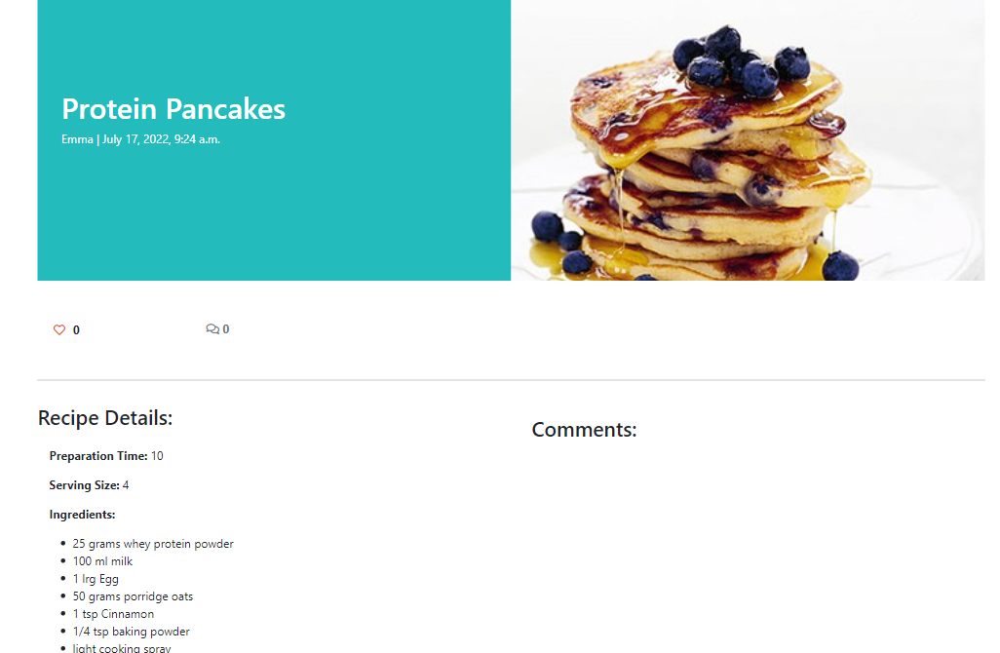

<!-- TOC -->
# Sweet Treats

Sweet Treats is a website that aims to create an online baking recipe community. This site allows users to share their favourite bakes with others as well as explore the site for new and exciting recipes that they can try at home.

Users can login, post their recipes, comment on posts by other users, edit posts they have previously uploaded, and like posts that have been uploaded by others. 

A link to the deployed website can be found <a href="https://sweet-treat-recipes.herokuapp.com/" alt="link to deployed heroku wedsite">here</a>.

<!-- TOC -->
## Table of Contents
<!-- TOC start -->
- [Sweet Treats](#sweet-treats)
  * [Table of Contents](#table-of-contents)
    + [Project Design](#project-design)
    + [User Experience](#user-experience)
    + [Project Goals](#project-goals)
    + [User Stories](#user-stories)
    + [Wireframe](#wireframe-1)
    + [Game Features](#game-features)
    + [Future Features](#future-features)
    + [Languages Used](#languages-used)
    + [Technology Used](#technology-used)
    + [Testing](#testing)
      - [Validation Testing:](#validation-testing)
    + [Bugs:](#bugs)
      - [Fixed Bugs:](#fixed-bugs)
    + [Deployment:](#deployment)
    + [References:](#references)
    + [Acknowledgements](#acknowledgements)
<!-- TOC end -->

<!-- TOC -->
### Project Design

- <a href="https://balsamiq.com/wireframes/">Balsamiq wireframes</a> was used to design the wireframes used in the design phase of this project. 

| Page | Wireframe |
| --- | --- |
| Home Page |  | 
| About Page |  | 
| Sign Up Page |  | 
| Sign In Page |  | 
| Delete Alert |  | 
| Medium Screen View |  | 
| Medium Screen View |  | 

- <a href="https://www.lucidchart.com/" >Lucid Charts</a> was used to design the unique models used in this project.

<!-- TOC -->
### User Experience
<!-- TOC -->
### Project Goals
My personal goals for this project are that:
- The site is easy to navigate and user friendly.
- The purpose of the site is evident and inviting to users.
- That users want to craete an account and engage with its content. 

<!-- TOC -->
### User Stories
As a user I want to:

- Easily understand the main purpose of the site, so that I can easily use the site.
- Easily navigate around the site, so that I can easily find content and clearly see where I am on the site.
- Be provided with a page containing a summary of all available posts so that I can decide what posts I would like to interact with. 
- Be able to read posts uploaded by other users in full and see any comments related those posts, so I can decide if I want to interact or try the recipe.
- See the author of posts and comments, so I can interact with them on the site.
- Sign up to the website, so that I can post my recipes, and then have the option to update and delete at a later date.
- Sign in to the website, so that I can comment and like posts created by others.
- Easily log in and log out of my account. 
- Find links to contact the owner of the site on social media. 
- See the date a post or comment was created so that I can see any updates or suggestions to recipes.
- See how many comments are attached to a post before clicking in to view it so that I can decide to if my comment has been made already.
- See how many likes are on a post without having to enter it in detail.
- Be able to like and unlike recipes on the site. 
- Post my own recipes to the site so that I can share with others and receive feedback or suggestions on my recipe.
- Update and delete my own posts so that I can keep the information up to date or make any adjustments once I have tried a bake. 
- Comment on my own posts so that I can reply and interact with other users.
- Comment on posts uploaded by others so that I can engage with the baking community. 
- Access the site on various devices such as desktop, tablet or mobile to that I can use the site on the go. 
- Understand that if an error occurs how I can address it.
- Be notified when my interactions with the site have been successful for example when I have logged in/out sucsessfully or when I have posted or commented on the site. 
- View a paginated list of posts so I can easily navigate through a list of posts. 

As an Admin I want to: 
- I can log in to allow management of a supportive and safe baking online communinity, by approving or removing posts and comments if required.
- I can log in and update or delete objectionable posts and comments if required.
- Create drafts so that I can return and finish writing content at a later date. 
- Like and unlike posts so that I can also interact with the sites contents. 

<!-- TOC -->
### Agile Design
- An Agile Approach was used to develop this site. This was achieved by breaking the project down into smaller tasks. 

To complete the overall aim of the Sweet Treats website concept, 14 issues were documented as specific tasks called User Stories. These User Stories are small sections of the project designed to accomplish a specific goal. 
The acceptance criteria I followed when completing this development project was that if when completing and testing each User Story, the task was completed sucessfully such as liking a post or logging in and out of the site then I deemed the passing conditions met. Once the User Story was working effectively it was moved across the Kanban board. 

As mentioned above this project used a Kaban board, which was set up in my <a href="https://github.com/AmyDelaney94/sweet-treats/projects/1" alt="link to Kanban Board">GitHub Projects here</a>, to help keep track of the work that was left to do,that was in progress and that was completed.

Examples of how my project progressed through the use of the Kanban board can be seen below.
| Week | Board |
| --- | --- |
| Week 1 |  | 
| Week 2 |    | 
| Week 3 |    |
| Week 4 |  | 
| Week 5 |  | 
| Week 6 |  | 
| Week 7 |  | 

<!-- TOC -->
### Current Features
The user stories mentioned above were used to enusre a positive UX was achieved.

| Feature | Details | Example |
| --- | --- | --- | 
| Favicon | - The favion image was selected to continue with the baking theme of the site.   - The favicon icon is visible in the browser tab and search engine history.  - It adds a unique identifier to the site. |  | 
| Header | - The header is fixed at the top of the page which allows the user to scroll the site.   - The colour of #23bbbb was chosen as the main colour throughout the site and is used in the Header with white text which is easily read. |  |
| Footer | - The footer also carries the same colour scheme as the header.   - The footer contains social media links with added icons from Font Awesome   - Footer contains a created by and authors name. |  |
| Site Navigation | - The navigation bar changes depending on user status, with one view if logged in and a second view if logged out.   - The nav bar is responsive on smaller screen sizes it changes to a button with a dropdown list. |  |
| Pagination | - To improve UX pagination was added so that each page displays a maximum of 6 posts. |  | 
| Home Page | - The Recipes page is the sites landing page.   - It displays 6 posts per page and includes the author along with the number of likes on each post.   - Bootstrap was used to ensure all cards are the same height regardless of recipe title length.   - Date of publising is also displayed on each recipe card.   - The colour theme is continued with the authors name featured on a #23bbbb background. |   |
| About Us  | - Font Awesome was used to add icons to page title.   -Aim and purpose of the page is displayed here.   - Tips for page navigation and log in benefits are also displayed here.   Link to the homepage and signup page are also embedded in the text. | |
| Post View  | - When a post is selected users can see the author, when it was posted, number of likes and comments and the featured image.  - Logged in users will be able to view the comment box.   - If users are logged in but not the author they do not see the edit and delete options.   - If visitors to the site are not logged in they cannot see the option to leave a comment. |    |
| Creating a Comment | - Text box is only displayed if user is logged in.   - Once publised the time, date and authors name is published with the comment. |  |
| Creating a Post | - Logged in user has the ability to create a post.   - All fields must be filled in or a promt appears before it allows user to submit the post.   Summernote Widgets were used for the Ingredients and Instruction sections to allow users to create easy to read posts.   - An option to add an image is also provided. |   | 
| Update and Delete Options | - If the author of a post is logged in they have the option to either edit or delete their post.   - The edit and delete buttons are the same colour theme as the rest of the site and redirect the user to the selected page. ||
| Updating a Post | Logged in author of a post has the ability to Update their post.   - All fields appear pre-populated with original information.   Summernote Widgets are also used for this feature.   - An option to add or change the image is also provided. |  |
| Deleting a Post | - If the author of a post selects to delete their post they will be asked to confirm again before deletion. | |
| Account Registration | - New users are asked to complete a registration form before continuing to the site. |  |
| Log in/out | Users that are returing have a simplified form to fill in that requires a user name and password.   - A promt appears when logout is selected asking the user to confirm their choice before continuing. |  |
| Admin Account | - A superuser was created for this project to manage the administration section.   - Admin users have more functionality than regular users and have full CRUD functionality over information such as users, posts and comments.   - Only approved admin users can access this section of the site. It is accessed by assing /admin to the URL home page and signing in. |  | 

<!-- TOC -->
### Future Features
Given more time to work on this project the overall scope of the website could be expanded. 
- User Profiles:
    - Allow users to create and edit their own user profiles.
    - As part of this they could add profile pictures and a brief biography about themselves. 
    - The User profile would also contain a list of recipes created by the user like an online recipe book.
- Paginate the comments section of the site to ensure that the page remains user friendly across all device sizes. 
- Reply to comments to further enhance interactivity. 
- Allow users to view other profiles to connect with other bakers. 

<!-- TOC -->
### Languages Used
- Python: Language chosen to develop the interaction with the server. 
- HTML: Markup language used to create the front end web pages.
- CSS: Styling language used to add custom styling to site.

<!-- TOC -->
### Technology Used
| Type | Technology | Function |
| --- | --- | --- | 
|Framework | Django| python framework used to create backend logic |
|Framework | Bootstrap5 | CSS Framework for developing mobile-first responsiveness across multiple screen sizes |
| Library | Django-allauth | Authentication library used to create the user accounts| 
| Library | Summernote | | WYSIWYG editor that allowed users to edit and personalise posts | 
| Application | Crispy Forms |  Used to manage Django Forms without having to re-write templates |
| Application | Psycopg2 | Database driver used to connect to the database to Python code | 
| Database | SQLite|  used as the database during development|
| Database | PostgreSQL| The database used to store all the data on deployment site | 
| Other Resources | Chrome DevTools | Used to debug and view changes | 
| Other Resources | Balsamiq Wireframes| Chosen to design wireframes during project planning | 
| Other Resources | LucidCharts |  Used to create models used in the project | 
| Other Resources | Cloudinary | Image hosting platform used to upload images |
| Other Resources | Font Awesome | Used for visual icons on the site to enhance UX | 
| Other Resources | Color-Hex and Color-Hexa | Used to chose colour scheme and ensure colours were complimentary | 
| Other Resources | Am I Responsive? | Used to see responsive design throughout the process.
| GitHub | GitHub Projects | Used to visually track the progress of the project | 
| GitHub | GitHub Issues | Used to create the user stories managed in GitHub Projects | 
| Host | GitHub | To store the source code and ReadMe for the project | 
| Host | GitPod | IDE selected to build the project | 
| Host | Heroku | To Host the deployed website | 
| Package Manager | Pip3 | Used to install extra software not found in Python Library

<!-- TOC -->
### Testing

<!-- TOC -->
#### Validation Testing:

<!-- TOC -->
### Bugs:
<!-- TOC -->
#### Fixed Bugs:

<!-- TOC -->
### Deployment:
The application has been deployed using Heroku by following these steps:

Heroku was used to deploy the application.

Commit changes and push them to GitHub.
Go to the Heroku's website.
Create an account or select log in.
From the Heroku dashboard, click on "Create new app".
Enter the "App name" and "Choose a region" before clicking on "Create app".
Go to "Config Vars" under the "Settings" tab.
Click on "Reveals Config Vars" and add the KEY: CREDS and the VALUE stored in creds.json file if needed.
Add the Config Var, KEY: PORT and VALUE: 8000.
Go to "Buildpacks" section and click "Add buildpack".
Select "python" and click "Save changes"
Add "nodejs" buildpack as well using the same process.
Go to "Deployment method", under the "Deploy" tab select "GitHub" and click on "Connect to GitHub".
Go to "Connect to GitHub" section and "Search" the repository to be deployed.
Click "Connect" next the repository name.
Choose "Automatic deploys" or "Manual deploys" to deploy your application.

<!-- TOC -->
### References:

<!-- TOC -->
### Acknowledgements
- First I would like to thank my Partner for his love and support throughout the completion of this project.
- I would also like to thank my mentor Marcel for his advice and support.
- My friends for constantly testing the project.
- Tutor Assistance for their help and support.
- Code Institute and its Slack community for their support and providing me with the necessary knowledge to complete this project.